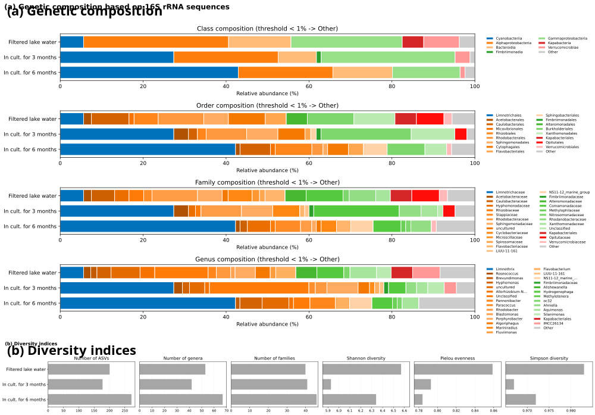

### Visualization of 16S rRNA metagenomic results across samples

#### Subplot a: Genetic diversity
This script visualizes the metagenomic diversity across different samples at different taxonomic levels.

```bash
DATDIR="DATA__Figure_16S_rRNA_metagenomics"
OUTDIR="VIZ__Figure_16S_rRNA_metagenomics"

python SCRIPT__vertically_stacked_taxonomy_barcharts.py \
    $DATDIR/ \
    -r c \
    -o $OUTDIR/Fig_16S_rRNA_metagenomics \
    -t 1 \
    --metadata $DATDIR/metadata__genus-table.csv
```

#### Subplot b: Diversity indices
This script visualizes the diversity indices across different samples.

```bash
DATDIR="DATA__Figure_16S_rRNA_metagenomics"
OUTDIR="VIZ__Figure_16S_rRNA_metagenomics"

python SCRIPT__horizontally_stacked_diversity_index_barcharts.py \
    $DATDIR/ \
    -o $OUTDIR/Fig_16S_rRNA_diversityIndices \
    --metadata $DATDIR/metadata__METRICS.csv
```

#### Combining subplots

```bash
pip install svgutils
pip install cairosvg

OUTDIR="VIZ__Figure_16S_rRNA_metagenomics"

python - <<PY
from svgutils.compose import Figure, SVG, Text
import xml.etree.ElementTree as ET
import cairosvg

def get_size(svgfile):
    root = ET.parse(svgfile).getroot()
    width = float(root.attrib["width"].replace("pt","").replace("px",""))
    height = float(root.attrib["height"].replace("pt","").replace("px",""))
    return width, height

svg1 = "${OUTDIR}/Fig_16S_rRNA_metagenomics.svg"
svg2 = "${OUTDIR}/Fig_16S_rRNA_diversityIndices.svg"

w1, h1 = get_size(svg1)
w2, h2 = get_size(svg2)

target_width = 1000

scale1 = target_width / w1
scale2 = target_width / w2

new_h1 = h1 * scale1
new_h2 = h2 * scale2

combined_svg = "${OUTDIR}/combined.svg"
combined_png = "${OUTDIR}/combined.png"

Figure(
    f"{target_width}px",
    f"{new_h1 + new_h2}px",

    SVG(svg1).scale(scale1).move(0, 0),
    SVG(svg2).scale(scale2).move(0, new_h1),
    Text("(a) Genetic composition", 12, 26, size=16, weight="bold"),
    Text("(b) Diversity indices", 12, new_h1 + 26, size=16, weight="bold")

).save(combined_svg)

cairosvg.svg2png(url=combined_svg, write_to=combined_png)

PY
```


Figure: Combined metagenomic panels (genetic composition and diversity indices)
