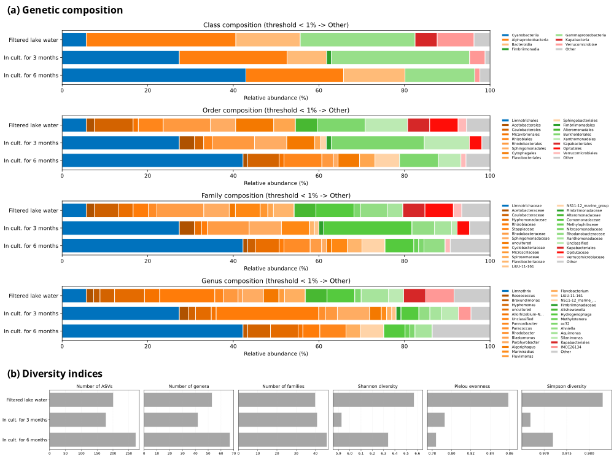
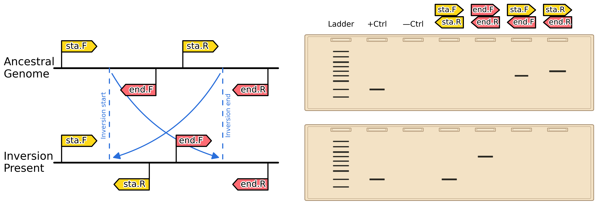
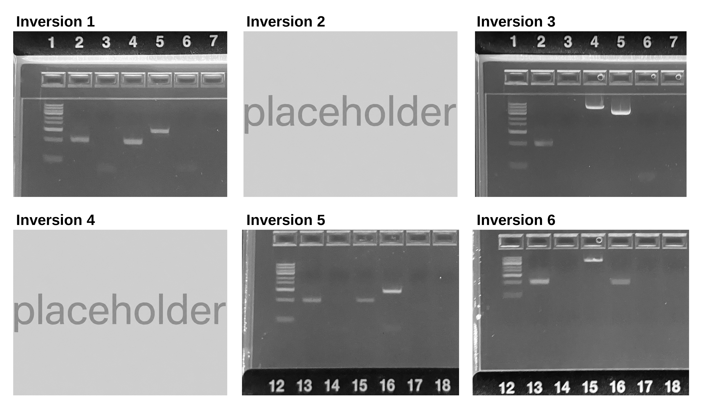

# PAPER Acquah et al. - Figures and Tables
Code for generating publication-quality figures and tables for the manuscript of Acquah et al.

### Cross-connection
The analysis files of the data visualized here can be found on [Zenodo.org](https://zenodo.org/) under the repository with the DOI [10.5281/zenodo.20129247](https://doi.org/10.5281/zenodo.20129247).

### Visualizations

#### Figure: 16S rRNA metagenomics
The code for creating the following figure is displayed [here](CODE__Figure_16S_rRNA_metagenomics.md).

#### Figure: Genomic inversion testing
The code for creating the following figure is displayed [here](CODE__Genomic_inversion_testing.md).

