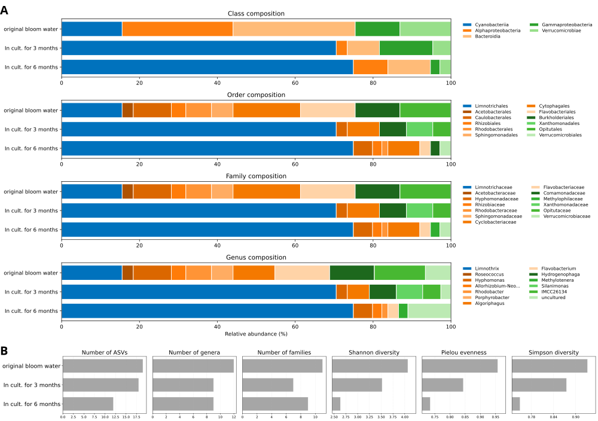
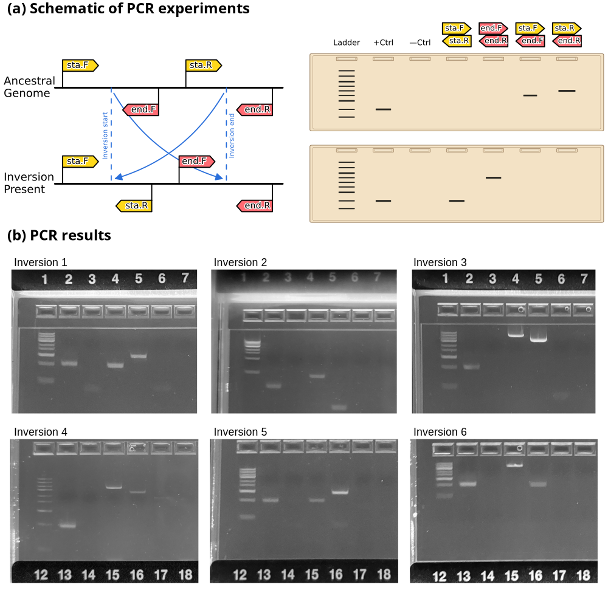

# PAPER Acquah et al. - Figures and Tables
Code for generating publication-quality figures and tables for the manuscript of Acquah et al.

### Cross-connection
The analysis files of the data visualized here can be found on [Zenodo.org](https://zenodo.org/) under the repository with the DOI [10.5281/zenodo.20129247](https://doi.org/10.5281/zenodo.20129247).

### Visualizations

#### Figure: 16S rRNA metagenomics
The code for creating the following figure is displayed [here](CODE__Figure_16S_rRNA_metagenomics.md).

#### Figure: Genomic inversion testing
The code for creating the following figure is displayed [here](CODE__Genomic_inversion_testing.md).

#### Table: Custom PCR primers for genomic inversion testing
The following oligonucleotide PCR primers were designed and used in the genomic inversion testing

| Inversion | Oligo Name | Oligo Sequence (5' to 3') | Approx. amplicon length |
| --------- | ---------- | ------------------------- | ----------------------- |
| 1         | sta.F      | AGCTARARAATCGCGCGATTAY    | Inv1.sta: 300 bp        |
| 1         | sta.R      | GGAGCATCAACCATGAAACAGC    |                         |
| 1         | end.F      | ATCCAGATTGGTACTTGGAAGCG   | Inv1.end: 400 bp        |
| 1         | end.R      | CTAGACTAAACTTCGGGGGTAGAC  |                         |
| ---       | ---        | ---                       | ---                     |
| 2         | sta.F      | TTGTGCATACCAAGTCCAAAAGTC  | Inv2.sta: 450 bp        |
| 2         | sta.R      | GGTAAGGAATTCGGGCTGATAGTA  |                         |
| 2         | end.F      | AAAACAGGAACMAAATAGCAGGGG  | Inv2.end: 120 bp        |
| 2         | end.R      | GATTTGTCAGCGTTAGAGATTGGG  |                         |
| ---       | ---        | ---                       | ---                     |
| 3         | sta.F      | AGGTCTAGCACTTCTGAGAGGAT   | Inv3.sta: 3000 bp       |
| 3         | sta.R      | GAAATTTTCAGCCGAATTCGCAC   |                         |
| 3         | end.F      | CGTTGCCCATCCCTGAAGAT      | Inv3.end: 1900 bp       |
| 3         | end.R      | AGAGCCGATCGTTGCGATAG      |                         |
| ---       | ---        | ---                       | ---                     |
| 4         | sta.F      | CCCAATGGTCACGMAAGGGTTAAT  | Inv4.sta: 1900 bp       |
| 4         | sta.R      | AAGGCATTGAACAAGGTATTGAGC  |                         |
| 4         | end.F      | AAGCSAWGAAASAKYACCCARACT  | Inv4.end: 1300 bp       |
| 4         | end.R      | YACCTACTAACTGCCTCATAGCAT  |                         |
| ---       | ---        | ---                       | ---                     |
| 5         | sta.F      | TYRCCAGTTCTTGMAATGCTGATT  | Inv5.sta: 300 bp        |
| 5         | sta.R      | TTTATCTATCAACGCTGTTTCGCC  |                         |
| 5         | end.F      | GCCATGTATTTGGATGTGTTGGAA  | Inv5.end: 470 bp        |
| 5         | end.R      | GCGATAGGCCCAAATCATAATTCC  |                         |
| ---       | ---        | ---                       | ---                     |
| 6         | sta.F      | AAAATCCGCCGAAGAAAATTTGC   | Inv6.sta: 2000 bp       |
| 6         | sta.R      | GGGAAGACCATYAAGGAAGCAGA   |                         |
| 6         | end.F      | ACAAAAACAACGAACAGGTAGGG   | Inv6.end: 290 bp        |
| 6         | end.R      | TTAACAATCCTTTCCCYACACCT   |                         |

The same table in LaTeX format [here](TABLES/TABLE_Custom_PCR_primers_for_genomic_inversion_testing.tex).

#### Tables: Read statistics and assessment of assembly quality
The code for extracting read statistics and assessing the quality of the assembly process is found [here](CODE__Assembly_quality_assessment.md). 

| Stage                                              | Illumina MiSeq - read pairs            | Oxford Nanopore - single reads |
| -------------------------------------------------- | -------------------------------------- | ------------------------------ |
| Pairs/reads pre-QC                                 | 8,581,010                              | 545,128                        |
| Pairs/reads post-QC (% of pre-QC)                  | 8,417,521 (98.09%)                     | 131,458 (24.12%)               |
| Avg. pair/read length post-QC (bp)                 | 295.2                                  | 4,527.4                        |
| Fully mapped pairs/reads (% of post-QC)            | 6,803,729 (80.83%)                     | 75,614 (57.52%)                |

The same tables in LaTeX format [here](TABLES/TABLE_Read_statistics_Illumina_and_OxfordNanopore.tex).

| Quality metric                         | Bacterial genome | Bacterial plasmid |
| -------------------------------------- | ---------------- | ----------------- |
| Length (bp)                            | 4,537,128        | 4,038             |
| N50                                    | 4,537,128        | 4,038             |
| L50                                    | 1                | 1                 |
| Longest segment (bp)                   | 4,537,128        | 4,038             |
| GC content (%)                         | 55.26%           | 49.33%            |
| Merqury: Consensus QV                  | 29.81            | 40.23             |
| Merqury: Est. error rate               | 1.04e-03         | 9.49e-05          |
| Merqury: K-mer completeness (%)        | 96.68%           | 94.51%            |
| QUAST: Avg. cov. depth (Illumina; ONT) | 416X; 84X        | 2402X; 295X       |
| QUAST: Cov. >= 1X (% - Illumina; ONT)  | 100%; 100%       | 100%; 100%        |
| QUAST: Cov. >= 10X (% - Illumina; ONT) | 100%; 100%       | 100%; 100%        |

Note: The first three rows were inferred based on the raw contigs, the other rows based on the corrected, circularized genomes. The analyses via Merqury only took into account the Illumina reads and used a kmer of 21 for the bacterial and a kmer of 17 for the plasmid genome. Abbreviations used: Cov.=coverage; Est.=Estimated; QV=Quality value.

The same tables in LaTeX format [here](TABLES/TABLE_Assembly_quality_metrics.tex).